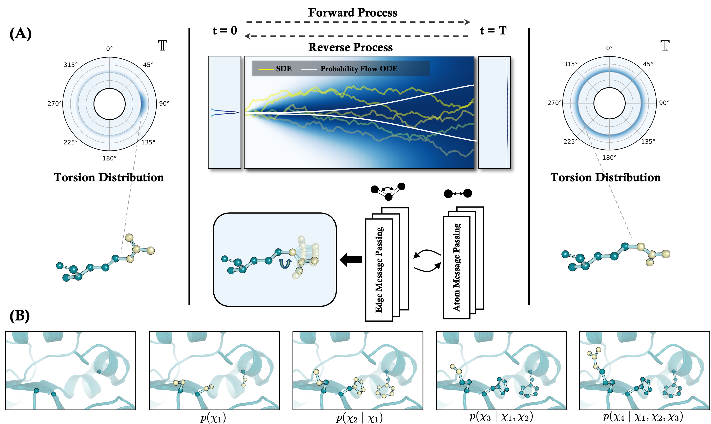

# DiffPack: A Torsional Diffusion Model for Autoregressive Protein Side-Chain Packing
**DiffPack** is a novel torsional diffusion model designed for predicting the conformation of protein side-chains based on their backbones, as introduced in [arxiv link](https://arxiv.org/abs/2306.01794). By learning the joint distribution of side-chain torsional angles through a process of diffusing and denoising on the torsional space, DiffPack significantly improves angle accuracy across various benchmarks for protein side-chain packing. 


## Installation
You can install DiffPack with the following commands, which will install all the dependencies.
```shell
conda create -n diffpack python=3.8
conda activate diffpack
```

```shell
conda install pytorch torchvision torchaudio pytorch-cuda=11.7 -c pytorch -c nvidia
conda install pyg -c pyg
conda install torchdrug -c milagraph -c conda-forge -c pytorch -c pyg
```

```shell
pip install biopython==1.77
pip install pyyaml
pip install easydict
```


## Model Checkpoints
We provide several versions of DiffPack, each with its own configuration and checkpoint:

| Model                                 | Config                                     | Checkpoint            |
|---------------------------------------|--------------------------------------------|-----------------------|
| DiffPack (Vanila)                     | [Config](config/inference.yaml)            | [Google Drive Link](https://drive.google.com/file/d/1tZ9ZOjIxq9SxrkdvbLJyLUBbt2P-mksO/view?usp=sharing) |
 | DiffPack (with Confidence Prediction) | [Config](config/inference_confidence.yaml) | [Google Drive Link](https://drive.google.com/file/d/1tZ9ZOjIxq9SxrkdvbLJyLUBbt2P-mksO/view?usp=sharing) |

The Vanilla version of DiffPack is the base model, 
while the version with Confidence Prediction includes an additional feature that estimates the confidence score of the predicted side-chain conformation.

Most of the configuration is specified in the configuration file. We list some important configuration hyperparameters here:
- `mode`: Backward mode in diffusion process. We use `ode` or `sde` for DiffPack.
- `annealed_temp`: Annealing temperature in diffusion process. We use `3` for DiffPack. Ideally, higher value corresponds to lower temperature.
- `num_sample`: Number of samples in diffusion process. Confidence model will decide which sample to use.

## Running DiffPack
To use DiffPack for new proteins on your local machine, we provide the necessary configuration files in the config/ folder. 
For instance, if you have two pdb files 1a3a.pdb and 1a3b.pdb, 
you can run the following command to infer new proteins and save the results in your chosen output folder:
```shell
python script/inference.py -c config/inference_confidence.yaml \
                           --seed 2023 \
                           --output_dir path/to/output \
                           --pdb_files 1a3a.pdb 1a3b.pdb ...
```
This command will generate and save the predicted side-chain conformations for the given proteins. 

## Retraining DiffPack
For those interested in training DiffPack on their own datasets, we will soon release the code and instructions for this process. 
Stay tuned for updates!

## Visualization of Results


## License
This project is licensed under the MIT License - see the [LICENSE](LICENSE) file for details.
## Citation
If you find DiffPack useful in your research or project, please cite our paper:
```
@article{zhang2023diffpack,
  title={DiffPack: A Torsional Diffusion Model for Autoregressive Protein Side-Chain Packing},
  author={Zhang, Yangtian and Zhang, Zuobai and Zhong, Bozitao and Misra, Sanchit and Tang, Jian},
  journal={arXiv preprint arXiv:2306.01794},
  year={2023}
}
```

